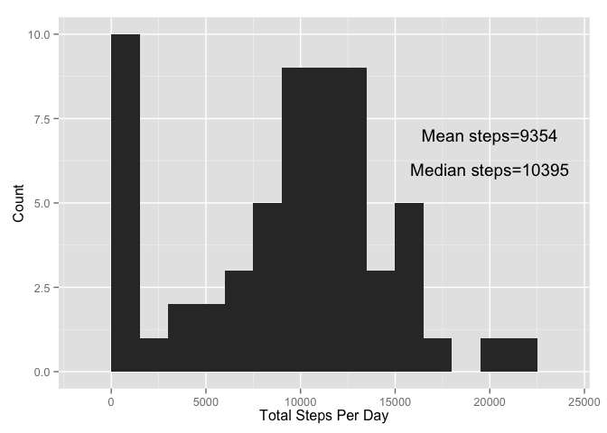
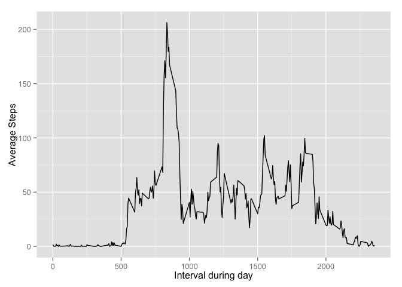
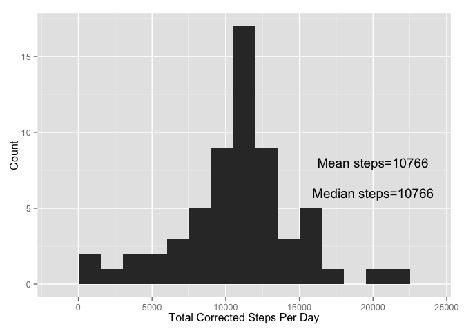
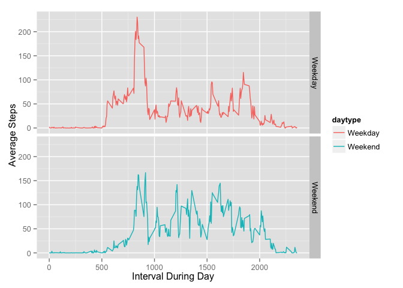

# Reproducible Research: Peer Assessment 1
Linda Lester  
May 15, 2015  

## Loading and preprocessing the data


I loaded the appropriate libraries for data download and analysis.  I specifically choose libraries that would allow me to tidy the data and manipulate the time and interval data collections


```r
library(dplyr)
```

```
## 
## Attaching package: 'dplyr'
## 
## The following object is masked from 'package:stats':
## 
##     filter
## 
## The following objects are masked from 'package:base':
## 
##     intersect, setdiff, setequal, union
```

```r
library(ggplot2)
library(lubridate)
act <- read.csv("activity.csv", stringsAsFactors=F)
```
## What is mean total number of steps taken per day?

To determine the total number of steps taken per day I first converted steps to a numeric then I grouped by data by day. I also determined and mean and median number of steps per day by calling the mean and median functions in addition to sum. The daily total steps data is in the data frame act3.  The sum, mean and median step counts were calculated.  The mean and median steps were 9354 and 10395, respectively.

```r
act2 <- act %>%
  mutate(nsteps = as.numeric(steps)) 
act3 <-group_by(act2,date) %>%
  summarize(xsteps = sum(nsteps, na.rm=TRUE))


ggplot(act3, aes( xsteps)) +
  geom_histogram(binwidth=1500) +
      xlab ("Total Steps Per Day") +
      ylab ( "Count")+
      annotate("text", x=20000, y= 7.0, label = "Mean steps=9354")+
      annotate("text", x=20000, y= 6.0, label = "Median steps=10395")
```

 

```r
stepmean <- summarize(act3, mean(xsteps, na.rm=TRUE))
stepmedian <- summarize(act3, median(xsteps, na.rm=TRUE))
```

## What is the average daily activity pattern?

To show the average daily activity I first took the mean of the number of steps per day. I then constructed a time series graph using the 5 minute intervals on the x axis. Per the graph I conclude that the interval of time from 830 to 835 had the highest number of step (206).

```r
act4 <- act %>%
  mutate(nsteps = as.numeric(steps)) %>%
  group_by(interval) %>%
  summarize(xsteps = mean(nsteps, na.rm=TRUE)) 

ggplot(act4, aes(interval, xsteps))+
  geom_line()+
  xlab ("Interval during day")+
  ylab ("Average Steps")
```

 

## Imputing missing values

Initially I determined how many NAs were missing in the data.  The total number of NA values is 2304.

I then Grouped by interval, took aa average step count for each interval and used this value for the missing data. The data was stored as act7.

## Effect of Replacing Missing Values
There was a small effect of modifying of removing the NAs on the data.  The graph illustrates a small peak at zero reflecting the loss of the NAs.  I repeated the mean and median analysis using the new data set. There was a slight increase in the mean compared to the unadjusted data (10766 compared to 9354) and the mean and median were the same with the adjusted data, reflecting the move towards the mean with the addition of the averaged data.


```r
NumNA <- sum(is.na(act))

act7 <-act %>%
  group_by(interval) %>%
  mutate(meansteps = mean(steps, na.rm =TRUE)) %>%
  mutate(newsteps = ifelse (is.na(steps), meansteps, steps)) %>%

  group_by(date)

  newstepsmean <- summarize(act7, mean(newsteps, na.rm=TRUE)) 
  newstepsmedian <- summarize(act7, median(newsteps, na.rm=TRUE)) 
act8 <- summarize(act7, newstepssum=sum(newsteps, na.rm=TRUE))
                          
##newstepsmean <- summarize(act7, mean(newsteps, na.rm=TRUE))
##newstepsmedian <- summarize(act7, median(newsteps, na.rm=TRUE))

ggplot(act8, aes( newstepssum)) +
  geom_histogram(binwidth=1500) +
      xlab ("Total Corrected Steps Per Day") +
      ylab ( "Count") +
      annotate("text", x=20000, y= 8.0, label = "Mean steps=10766")+
      annotate("text", x=20000, y= 6.0, label = "Median steps=10766")
```

 
## Are there differences in activity patterns between weekdays and weekends?

To determine differences in activity between weekdays and weekends I first converted the dates to weekdays in the transformed data set(act7) to include a variable called daytype for weekend or weekdays. Then I subset the data based upon either weekday or weekend. I then determined the activity level during the day for the weekend and weekdays.

Comparing the two graphs illustrates a slight differences in the pattern of activity during the weekend versus the weekday,  There is a more pronounced spike in activity during the morning for weekdays.  The weekends have a flatter activity curve.

```r
act9 <-act7 %>%
  mutate (weekDate = as.Date(date, format = "%Y-%m-%d")) %>%
  mutate (dayweek = weekdays(weekDate)) %>%
  mutate(daytype = ifelse (dayweek %in% c("Saturday", "Sunday"), "Weekend", "Weekday")) %>%
  group_by(daytype, interval) %>%
  summarize(wsteps = mean(newsteps, na.rm=TRUE))

ggplot(act9, aes(interval, wsteps, group = daytype, color = daytype))+
  geom_line()+
  facet_grid(daytype~.) +
  xlab ("Interval During Day")+
  ylab ("Average Steps")
```

 

